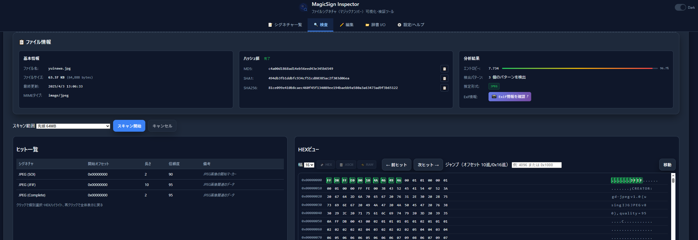

<!--
---
id: day040
slug: magic-sign-inspector

title: "MagicSign Inspector"

subtitle_ja: "ファイルシグネチャ（マジックナンバー）可視化・検証ツール"
subtitle_en: "File Signature (Magic Number) Visualization and Verification Tool"

description_ja: "ファイルのマジックナンバー（シグネチャ）を可視化・編集・検証できる軽量フォレンジック補助ツール。244種類のシグネチャ対応、HEXビュー、ハッシュ計算、foremost.conf出力など。"
description_en: "A lightweight forensic assistance tool for visualizing, editing, and verifying file magic numbers (signatures). Supports 244 signatures, HEX view, hash calculation, and foremost.conf export."

category_ja:
  - フォレンジック
  - バイナリ解析
category_en:
  - Forensics
  - Binary Analysis

difficulty: 2

tags:
  - magic-number
  - file-signature
  - hex-viewer
  - forensics
  - file-carving
  - ctf

repo_url: "https://github.com/ipusiron/magic-sign-inspector"
demo_url: "https://ipusiron.github.io/magic-sign-inspector/"

hub: true
---
-->

# MagicSign Inspector - ファイルシグネチャ（マジックナンバー）可視化・検証ツール


[](https://ipusiron.github.io/magic-sign-inspector/)

**Day040 - 生成AIで作るセキュリティツール100**

**MagicSign Inspector** は、ファイルの **マジックナンバー（シグネチャ）** を可視化・編集・検証できる軽量フォレンジック補助ツールです。

既定のマジックナンバー辞書を読み込み、任意のバイナリファイルを解析して一致箇所をハイライト表示します。
辞書はJSON形式での入出力に対応し、`foremost.conf` や `file` コマンドの **magic file** に近い定義の一部インポートも可能です。

---

## 🌐 デモページ

👉 [https://ipusiron.github.io/magic-sign-inspector/](https://ipusiron.github.io/magic-sign-inspector/)

---

## 📸 スクリーンショット

>   
>
> *JPEGファイルを検査*

---

## 🎯 ターゲット層

- **初級フォレンジック学習者**  
  マジックナンバーの基礎やファイル構造を学びたい人
- **CTFプレイヤー**  
  Carving系問題でシグネチャのカスタマイズや精度検証を行いたい人
- **デジタル捜査実務者**  
  既存ツールの前処理・結果検証のために軽量で素早く動くツールを求める人
- **セキュリティ教育者**  
  講義や演習でマジックナンバーとファイル識別の仕組みを視覚的に説明したい人

---

## 💡 活用例

1. **教育用途**  
   - JPEG/PNG/PDF/ZIPなどの代表的なシグネチャを実際のファイルに照合して学習
   - ワイルドカードや短いシグネチャの誤検知リスクを体験的に理解
2. **フォレンジック調査補助**  
   - ディスクイメージから抽出した断片的ファイルのシグネチャ確認
   - carving前に既知のシグネチャをテストして有効性を事前評価
3. **CTF/演習**  
   - 自作のマジックナンバーを登録して特定形式のデータ断片を効率的に発見
4. **結果検証**  
   - PhotoRecやForemostで抽出したファイルが正しい形式か辞書照合で確認

---

## 🎯 詳細活用シナリオ

### シナリオ1: CTF競技でのカスタムファイル形式解析

**背景**: CTF Forensics問題で、未知の拡張子`.mystery`ファイルが提供された

**手順**:
1. **初期調査**: ファイルをMagicSign Inspectorにドラッグ&ドロップ
2. **既知パターン確認**: 標準シグネチャ辞書でJPEG/PNG/ZIPなどの一般的な形式をチェック → ヒットなし
3. **手動解析開始**: HEXビューで先頭バイトを目視確認 → `4D 59 53 54 45 52 59` (ASCII: "MYSTERY") を発見
4. **カスタムシグネチャ作成**: 
   - 名前: "Mystery Format"
   - パターン: `4D 59 53 54 45 52 59`
   - オフセット: 0（絶対位置）
   - 信頼度: 95%
5. **検証・調整**: 複数の`.mystery`ファイルで検証し、必要に応じてパターンを調整
6. **フラグ発見**: シグネチャ照合でファイル構造を把握し、隠されたデータ領域を特定

**成果**: 手動HEX解析の時間を大幅短縮、パターンの再利用で類似問題への対応力向上

### シナリオ2: デジタル捜査でのデータ復旧精度向上

**背景**: 容疑者PCのHDDから削除された画像ファイルを復元する必要がある捜査案件

**手順**:
1. **事前準備**: MagicSign InspectorでJPEG/PNG/GIFシグネチャの精度をテストファイルで確認
2. **シグネチャ調整**: 
   - JPEG: `FF D8 FF E0`（一般的）に加えて `FF D8 FF E1`（Exif）も追加
   - PNG: `89 50 4E 47` の後に続く `0D 0A 1A 0A` まで含めて誤検知を削減
3. **Foremostによるカービング実行**:

```bash
# 調整した辞書をforemost.confにエクスポート
foremost -c custom_foremost.conf -i suspect_hdd.img -o recovered/
```

4. **結果検証**: 抽出された数百ファイルをMagicSign Inspectorで一括チェック
   - ただし、現バージョンの本ツールでは一括チェック機能はない。
   - 正常なJPEG: ヒット率100%、ファイルサイズと整合性確認
   - 偽陽性: シグネチャはヒットするがファイルとして不完全なデータを特定・除外
5. **精度向上**: 誤検知率を30%→5%に削減、証拠ファイルの信頼性向上

**成果**: 捜査時間の短縮、法廷で使用可能な高信頼性データの確保、再現可能な検証プロセスの確立

---

## 📂 ディレクトリー構成

```
magic-sign-inspector/
├── README.md                    # 本ファイル
├── LICENSE                      # MITライセンス
├── CLAUDE.md                    # 開発支援AI設定ファイル
├── index.html                   # メインHTML（SPA）
├── style.css                    # 統合CSSスタイル
├── assets/                      # 静的リソース
│   ├── favicon.svg             # ファビコン（FFD8デザイン）
│   ├── logo.svg                # アプリロゴ
│   └── screenshot.png          # デモ用スクリーンショット
├── js/                         # JavaScriptモジュール
│   ├── app.js                  # メインアプリケーション（1,412行）
│   ├── fileinfo.js             # ファイル情報・ハッシュ・Exif連携
│   ├── hexview.js              # HEXビューア（仮想スクロール対応）
│   └── worker.js               # WebWorker（大容量ファイル処理）
└── sigs/                       # シグネチャ辞書
    ├── default.json            # 基本マジックナンバー（91種）
    ├── enhanced.json           # 拡張画像・アーカイブ形式（88種）
    ├── forensics.json          # フォレンジック特化形式（40種）
    └── trailers.json           # 終端シグネチャ（25種）
```

---

## 🛠 仕様

### 🎯 主な機能

#### ファイル解析機能
- **244種類のシグネチャ対応** - JPEG/PNG/ZIP/PDF/EXE等の豊富な形式
- **ドラッグ&ドロップ解析** - 直感的なファイル読み込み
- **大容量ファイル対応** - 50MB+でもスムーズな処理（チャンク読み込み）
- **リアルタイムHEXビュー** - 仮想スクロールによる高速表示
- **エントロピー解析** - ファイルの複雑さ・暗号化判定

#### シグネチャ管理
- **GUIベース編集** - 直感的なシグネチャ作成・編集
- **JSON形式 I/O** - 辞書のインポート・エクスポート
- **信頼度設定** - 各シグネチャの信頼度調整
- **カテゴリ分類** - Image/Archive/Document等での整理
- **検索・フィルター** - 名前・拡張子・カテゴリでの絞り込み

#### ファイル情報表示
- **ハッシュ値計算** - MD5/SHA1/SHA256の並列計算
- **Exif情報連携** - JPEG/PNG検出時のImage Exif Checkerリンク
- **形式推定** - 複数ヒット時の信頼度付き表示
- **詳細メタデータ** - ファイルサイズ・更新日時等

#### ユーザビリティ
- **ダークモード** - 目に優しい表示切り替え
- **レスポンシブUI** - PC・タブレット・スマートフォン対応
- **キーボードショートカット** - HEXビューでのCtrl+C/A等
- **プライバシー重視** - 完全ローカル処理、外部送信なし

### 🔮 技術的特徴
- **トレーラー（終端）パターン対応** - ファイル終端の検証
- **相対オフセット検索** - 特定位置からの距離指定
- **WebWorker活用** - UIをブロックしない非同期処理
- **仮想スクロール** - 大容量ファイルでもメモリ効率的
- **パフォーマンス最適化** - GPU加速、CSS containment活用

---

## 🔗 他のセキュリティツールとの連携例

- **PhotoRec / Foremost / Scalpel**  
  - 本ツールでマジックナンバー定義を調整 → これらのツールに反映して精度向上
  - carving結果フォルダーを本ツールでスキャンしてヒット精度を可視化
- **Autopsy / FTK Imager**  
  - carvedファイルの真偽判定や、未知拡張子ファイルの形式推定補助
- **バイナリエディター**  
  - HEXビューやバイナリエディター的機能を組み合わせて詳細解析
- **CTF問題生成ツール**  
  - carving課題用の特殊シグネチャを作成し、教育コンテンツとして利用

---

## 🖥 `file` コマンドとの関連

### 共通点
Unix系OSの `file` コマンドと **MagicSign Inspector** は、以下の共通した仕組みを持っています：

- **バイトパターンマッチング**: ファイルの先頭や特定位置のバイト列を辞書と照合
- **拡張子に依存しない判定**: ファイル名ではなく実際のバイナリ内容で形式を識別
- **優先度・信頼度による選択**: 複数パターンがヒットした場合の判定ルール
- **オフセット指定**: ファイル先頭以外の位置も検索対象

### 相違点・本ツール独自の機能

| 項目 | `file` コマンド | MagicSign Inspector |
|------|----------------|-------------------|
| **実行環境** | Unix/Linux CLI | ブラウザー (GUI) |
| **結果表示** | テキスト1行 | ビジュアル・HEXビューで詳細表示 |
| **辞書編集** | テキストエディターで直接編集 | GUI フォームで直感的編集 |
| **複数ヒット** | 最優先の1つのみ表示 | すべてのヒット箇所をリスト・ハイライト表示 |
| **リアルタイム検証** | コマンド実行が必要 | ドラッグ&ドロップで即座に結果表示 |
| **カービングツール連携** | 間接的 | `foremost.conf` 直接エクスポート |

### 用語解説：ファイルカービング

**ファイルカービング（File Carving）** とは、破損・断片化したストレージからファイルのシグネチャ（マジックナンバー）を手がかりに、完全なファイルを復元・抽出する技術です。

- **応用分野**: デジタルフォレンジック、データ復旧、CTF競技
- **主要ツール**: `foremost`, `scalpel`, `PhotoRec`, `bulk_extractor`
- **原理**: ファイルシステムの情報に頼らず、バイナリデータから直接ファイルの開始・終了を検出
- **課題**: シグネチャの精度が低いと大量の誤検知（false positive）が発生

**MagicSign Inspector** は、このカービング作業において **シグネチャの事前検証・調整** や **抽出結果の妥当性確認** に活用できます。

---

## 🚀 インストール / 利用方法

### オンラインで使う（推奨）
GitHub Pagesにアクセスするだけで利用可能です。  

👉 [MagicSign Inspector デモページ](https://ipusiron.github.io/magic-sign-inspector/)

### ローカルで使う

本ツールは `fetch()` で辞書JSONを読み込み、`type="module"` と `Web Worker` を使用しています。
**`file://` で `index.html` を直接開くと CORS 制限により動作しません。**

ローカルでも必ずHTTPサーバー経由でアクセスしてください。

```bash
git clone https://github.com/ipusiron/magic-sign-inspector.git
cd magic-sign-inspector
```

#### 1) Python 標準サーバー（推奨・最短）

```bash
# プロジェクトのルートで実行
python -m http.server 5500
# もしくは Python 3 系が複数ある場合
python3 -m http.server 5500
```
ブラウザーで http://localhost:5500/ を開きます。

#### 2) Node.js ユーザー

```bash
# どちらか一方
npx http-server -p 5500
# または
npx serve -l 5500
```

#### 3) VS Code 「Live Server」拡張

"index.html"ファイルを右クリックして「Open with Live Server」を選びます。

---

## 🎨 ファビコンデザインについて

### FFD8の由来と意味

本ツールのファビコンには **「FF D8」** という文字が表示されていますが、これは偶然の文字列ではありません。

**FF D8** = **JPEGファイルのマジックナンバー（SOIマーカー）**

#### 技術的背景
- **FF D8** : JPEG画像の **SOI（Start of Image）** を示す必須のマーカー  
- **FF D8 FF E0** : 標準的なJFIF形式JPEGファイルの開始パターン  
- **FF D8 FF E1** : Exif情報を含むJPEGファイルの開始パターン  

#### ファビコンデザインの構成要素
```svg
┌─────────────────────────┐
│  🔵 青い背景（16進数）    │
│  FF  ← マジックナンバー   │
│  D8  ← 前半部分          │
│      🔍 虫眼鏡アイコン    │
│       （解析・検査）      │
└─────────────────────────┘
```

#### なぜJPEGマジックナンバーを選んだか？

1. **認知度の高さ**  
   - もっとも一般的なファイル形式の1つ  
   - バイナリ解析の学習入門として最適  

2. **視覚的分かりやすさ**  
   - 16進数「FF D8」として覚えやすい  
   - ファイル先頭に必ず出現するため誤解が少ない  

3. **ツールの目的との親和性**  
   - 画像ファイル = 視覚的コンテンツ  
   - マジックナンバー検出 = 虫眼鏡での詳細調査  

このファビコンは、**MagicSign Inspector** が「ファイルシグネチャ解析ツール」であることを、もっとも代表的なマジックナンバーを使って表現したシンボルデザインです。

---

## 📚 詳細ドキュメント

### 🔧 開発者向け情報
- **[TECHNICAL.md](TECHNICAL.md)** - 技術仕様・アーキテクチャ・パフォーマンス最適化
- **[DEVELOPMENT.md](DEVELOPMENT.md)** - 開発メモ・トラブルシューティング・今後の方針

### 🎯 プロジェクト管理
- **[CLAUDE.md](CLAUDE.md)** - AI開発支援設定・コンテキスト情報

---

## 📚 関連リソース

### 自作ツール

- [Image Exif Checker](https://github.com/ipusiron/image-exif-checker)
  - 本ツールでJPEG/PNGファイルであることが判明したら、Image Exif Checkerを使ってExifメタ情報を確認できる。

---

## 📄 ライセンス

MIT License - 詳細は [LICENSE](LICENSE) をご覧ください。

---

## 🛠 このツールについて

本ツールは、「生成AIで作るセキュリティツール100」プロジェクトの一環として開発されました。 このプロジェクトでは、AIの支援を活用しながら、セキュリティに関連するさまざまなツールを100日間にわたり制作・公開していく取り組みを行っています。

プロジェクトの詳細や他のツールについては、以下のページをご覧ください。

🔗 [https://akademeia.info/?page_id=42163](https://akademeia.info/?page_id=42163)
